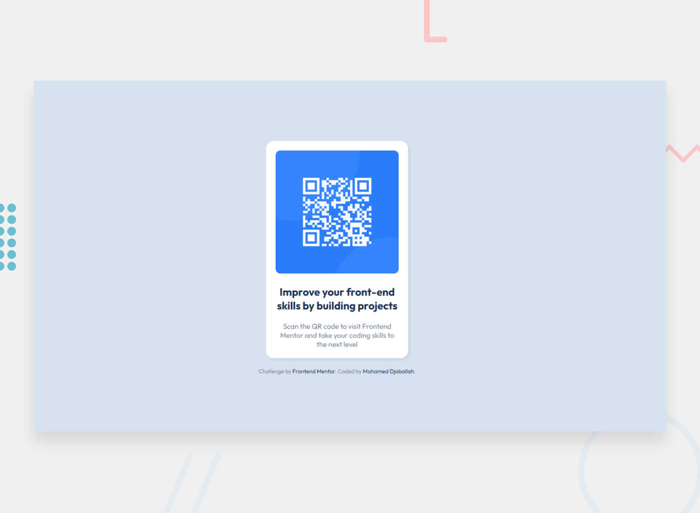

# Frontend Mentor - QR code component solution

This is a solution to the [QR code component challenge on Frontend Mentor](https://www.frontendmentor.io/challenges/qr-code-component-iux_sIO_H). Frontend Mentor challenges help you improve your coding skills by building realistic projects. 

## Table of contents

- [Overview](#overview)
  - [Screenshot](#screenshot)
  - [Links](#links)
- [My process](#my-process)
  - [Built with](#built-with)
  - [What I learned](#what-i-learned)
  - [Continued development](#continued-development)
  - [Useful resources](#useful-resources)
- [Author](#author)
- [Acknowledgments](#acknowledgments)

**Note: Delete this note and update the table of contents based on what sections you keep.**

## Overview
This is a solution to the [QR Code Component challenge on Frontend Mentor](https://www.frontendmentor.io/challenges/qr-code-component-iux_sIO_H). The project displays a responsive QR code card that links to Frontend Mentor, built with HTML and CSS, focusing on accessibility and cross-platform compatibility.

### Screenshot


### Links
- **Solution URL**: [GitHub Repository](https://github.com/Djabouex/qr-code-component/)
- **Live Site URL**: [Live Demo](https://djabouex.github.io/qr-code-component/)

## My Process

### Built With
- Semantic HTML5 markup
- CSS custom properties
- Flexbox for responsive layout
- Mobile-first workflow
- Google Fonts (`Outfit` font)
- `.gitattributes` for consistent line endings

### What I Learned
- **Responsive Design**: Using Flexbox to center the QR code card and a mobile-first approach with media queries (`@media (min-width: 375px)`) ensured a consistent layout across devices.
- **Accessibility**: Adding `<main>` and `<footer>` landmarks resolved accessibility warnings (`landmark-one-main` and `region`), improving semantic structure for screen readers.
- **Git Management**: Resolved divergent branch issues using `git pull --no-rebase` and normalized line endings with `.gitattributes` to ensure cross-platform compatibility.

### Continued Development
In future projects, I plan to:
- Incorporate ARIA attributes for enhanced accessibility.
- Experiment with CSS animations (e.g., hover effects) for better interactivity.
- Optimize Google Fonts loading with preloading or fallback strategies.

### Useful Resources
- [Frontend Mentor Style Guide](https://www.frontendmentor.io/) - For color and typography references.
- [MDN Web Docs: Flexbox](https://developer.mozilla.org/en-US/docs/Web/CSS/CSS_Flexible_Box_Layout) - For responsive layout techniques.
- [Git Documentation](https://git-scm.com/doc) - For resolving merge conflicts and managing line endings.

## Getting Started
To run this project locally:
1. Clone the repository:
   ```bash
   git clone https://github.com/Djabouex/qr-code-component.git
   ```
2. Navigate to the project folder:
   ```bash
   cd qr-code-component
   ```
3. Open `index.html` in a browser to view the project.

## Author
- **Name**: Mohamed Djaballah
- **Frontend Mentor**: [@Djabouex](https://www.frontendmentor.io/profile/Djabouex)
- **GitHub**: [Djabouex](https://github.com/Djabouex)

## Acknowledgments
This project was completed as part of the Frontend Mentor challenges to improve my front-end development skills. Thanks to Frontend Mentor for providing the design and challenge.